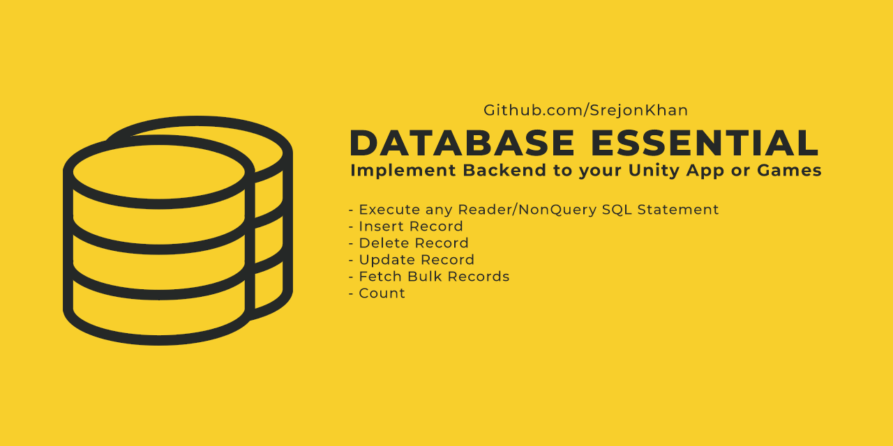

# DatabaseEssential-MySQL

A simple codebase to implement Backend to your Unity App or Games.



# Classes 

**DatabaseManager.cs**  Core class which contains all functions to initialize and command.

**ServerConfiguration.cs**  ScriptableObject Class, that allow to create multiple profile for different servers and change any server config easily.

**DatabaseTest.cs**  A test class to check the codebase. 


# Useful Functions 

**To close any existing connection from Server-**

```c# 
public bool Close() 

DatabaseEssential.DatabaseManager.instance.Close();
```

**To execute any Reader SQL Statement-**

```c# 
public string Query(string statement)

DatabaseEssential.DatabaseManager.instance.Query("SELECT * FROM userdata ORDER BY ID DESC");
``` 

**To execute Non-Query SQL Command-**

```c#
public void NonQuery(string statement)

DatabaseEssential.DatabaseManager.instance.NonQuery("UPDATE MyGuests SET lastname='Doe' WHERE id=2");
``` 


**To Insert Record(s) to Table-**

```c#
public void InsertRecord(string tableName, string keys, string values)

DatabaseEssential.DatabaseManager.instance.InsertRecord("userdata", "ID,Username,Password,Email,Phone,Address", $"'0', '{randomName}', '123456', '{randomName}@gmail.com', '0123456789', 'Unknown Street, Unknown Street'");
``` 


**To Delete Record(s) from Table-**

```c#
public void DeleteRecord(string tableName, string condition)

DatabaseEssential.DatabaseManager.instance.DeleteRecord("userdata", "Username='Ashikur Rahman'");
``` 


**To Updata Data in Database-**

```c#
public void UpdateRecord(string tableName, string condition)

DatabaseEssential.DatabaseManager.instance.UpdateRecord("userdata", "Username='Ashikur Rahman' WHERE Username='Srejon Khan'");
``` 


**To Fetch All Records from Table according to column name-**

```c#
public List<string>[] SelectAllRecord(string tableName, string columnName)

string columnName = "ID,Username,Password,Email,Phone,Address";
List<string>[] results = DatabaseEssential.DatabaseManager.instance.SelectAllRecord("userdata",columnName);

for (int i = 0; i < results.Length; i++)
{
    List<string> tempList = results[i];
    foreach (var records in tempList)
        Debug.Log(records);
}
``` 


**To count records of Table-**

```c#
public int Count(string tableName)

int userCount = DatabaseEssential.DatabaseManager.instance.Count("userdata");
``` 


# Contacts

**Srejon Khan**, Game Programmer

>Chasing dreams like I'm on Novocaine


**Mail:** srejonkhan9@gmail.com

**Facebook:** https://facebook.com/srejon.khan.75

**Instagram:** https://instagram.com/srejon_khan

**Youtube:** https://www.youtube.com/channel/UCwPq4rkea5O5JAetNFJvdGg

 